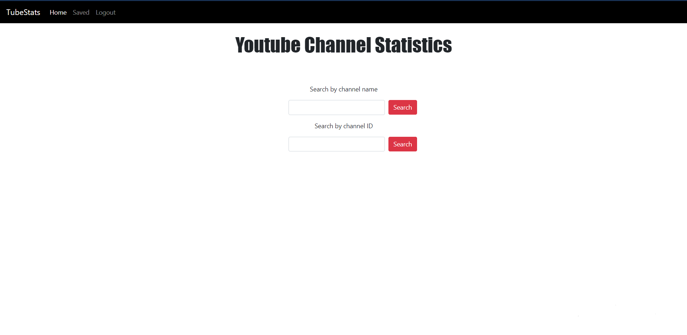

## Tube Stats

TubeStats is a website where you an view and save youtube channel statistics for various channels. It utilizes the YouTube API to proved statstics on total views, videos, subscribers and more. This website uses python and django to comunicate with the API and transfer information to the HTML. It also uses Javascript for asynchronous functions. As this uses the google API don't forget to look at the requirements.txt.

#### Features

1. Search YouTube channels by custom or alphanumeric ID.
   -Some channels use a generated id or a custom one similar to their channel. On TubeStats you can search any channel using either the custom or Youtube generated id.
2. View channel statistics such as total view, videos, subscribers.
3. View 6 recent videos.
4. Save, create and compare a watchlist of channels with all their statistics.

#### Files & Directories

- `Main Directory`
  - `capstone` - Main application.
    - `urls.py` - Contains all url paths for logins and for API functionality between the javascript and python.
    - `models.py` - Contains the "Saved Channels" model and login model for sql database implementation.
    - `views.py` - contains all the functions for calling the YouTube API, login, and saving and deleting channels.
  - `static`
    - `inbox.js` - Performs various asynchronous functions as well as communicating information about a channel to the saveChannel function in `views.py`.
    - `style.css` - Used for styling the website as well as the information from the API.
  - `templates` - Holds all the html files for the website

#### Design

The design is a minimalistic theme that follows the same white, red and black color pallete as YouTube to hold some similarity.

#### Justification

The reason that this project is distinct for the previous projects is the purpose of the website and the use of an API. This project combines aspects of all previous projects while also utilizing new knowledge from outside the course. You can use it to compare your channel(s) to other channels, or for a competition between friends to monitor channel growth.

#### Preview

